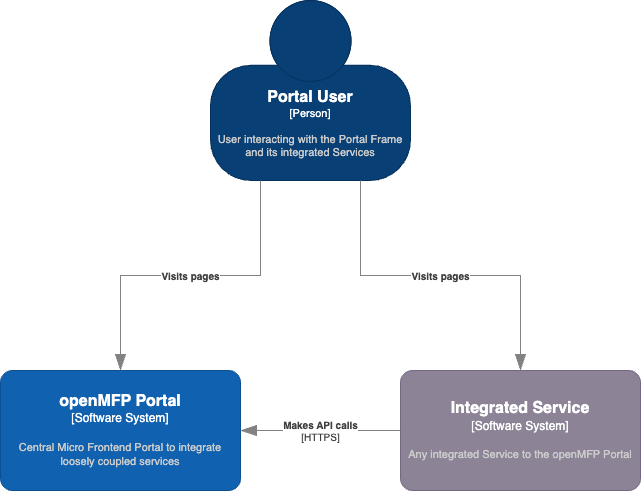
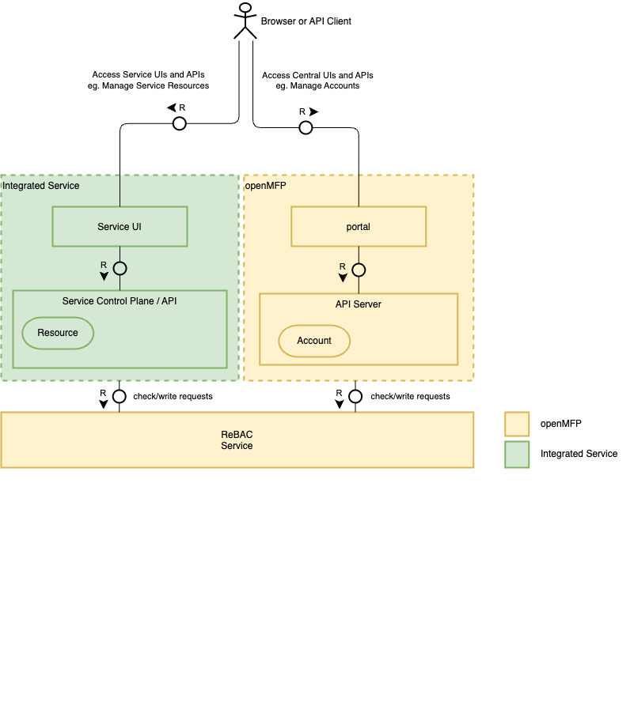
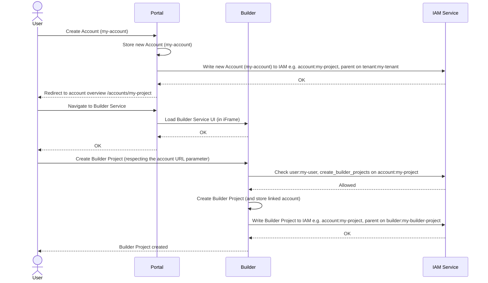

# RFC for openMFP Account Management and Service Integration

> [!WARNING]  
> This RFC is invalidated, as it is replaced by [RFC for openMFP Account Management and Service Integration using a Central Control Plane](./003-account-management-and-service-integration-using-a-central-control-plane.md). Please disregard.

## Context and Problem Statement

This document provides an outline for the central account management of openmfp and its interaction with contributing services. In this context, an account entity is meant to be a grouping entity that groups several resources - similar to a hyperscaler account. In openmfp, the account will allow users to group resources of underlying services indirectly. It is also a key entity that other aspects of openmfp, like extensions, will build upon.

The ultimate objective isn't to envision a distant future scenario, but to propose a short to mid-term strategy that allows the integration of services into the openmfp ecosystem.

## Decision Drivers

- The account management must be service agnostic, not making presumptions about future integrated services.
- The account management should not necessitate deep integration of services, as it would require significant effort on the service side.
- The account management needs to be a central part of the overall authorization schema.

## Out of Scope

- This document does not detail the process of enabling a service on the portal in general. It presumes that the integrated service is configured to be accessible to all accounts on the portal.

## Options Considered

- An account loosely linked with a service-specific onboarding experience.

### Loosely Coupled Account with a Service-Specific Onboarding Experience

In this scenario, the account management is solely responsible for creating and managing accounts. Services that wish to integrate into the openmfp ecosystem must implement a service-specific onboarding experience. This includes creating service-specific resources and persisting the link to the central account management.

The following sequence diagram visualizes the onboarding experience of a service named "Builder". The "Builder" offers a "Project" Resource. In this example, the integrated service also uses a Kubernetes API Server for resource management.

## Benefits and Drawbacks

- **Pros:**
  - The account management minimally impacts the integrated service.
  - The account management does not make assumptions about the implementation of the integrated service.
- **Cons:**
  - The openMFP API Server lacks information about the entities of the integrated services, making it harder to provide a unified experience.
  - The API Consumer will need to interact with both central APIs and the integrated service APIs, resulting in increased end-user complexity.
