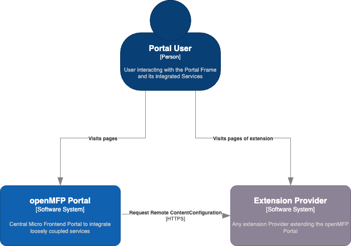
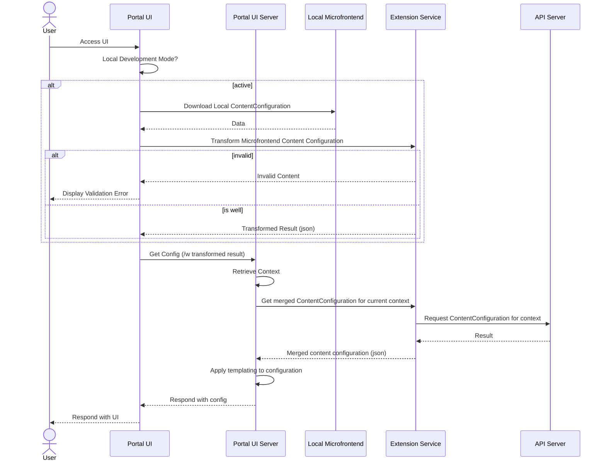

# RFC for openMFP Extension Management - Content Configuration Processing

## Context and Problem Statement

The extension manager will be responsible to provide the API's needed for extension configuration in openMFP. A Extension is a to be integrated User interface or Micro Frontend, which extend the portal in the form of a Webcomponent to a complete web application.
The openMFP Portal dynamically evaluates the installed extensions and surfaces the UI's for a given entity and context dynamically. This rfc focusses specifically on Extension `ContentConfiguration` (CC) processing. The `ContentConfiguration` is the configuration API that describes how a given extension would like to be integrated.



## Design Drivers

- The `ContentConfiguration` process need to be asynchronous, at the time of the web request the processed configugration must be available.
- The `ContentConfiguration` processing needs to allow for the possibility to reject a configuration change. In case a Extension Provider responds with a invalid `ContentConfiguration` definition, the `Content Configuration` processing must be able to reject the change.
- The `ContentConfiguration` processing to allow for inline definition of `ContentConfiguration` content as well as remote `ContentConfiguration`'s to be downloaded at time of processing

## Out of Scope

- This document does not detail out specifics of extensions in general, like extension classes and extension instances.
- This document does not detail out specifics of the CDM content, and how a CDM is structured.

## Options Considered

- Async processing of `ContentConfiguration` using a subroutine in the Extension Manager

### Async processing of ContentConfiguration using a subroutine in the Extension Manager

The Extension Manager will provide a custom resource definition - Content Configuration - that allows extension providers to describe how their extension should be integrated into the portal in a declarative way. The Extension Manager will then process the CC and store the observed state in its database. The Portal, when rendering the UI will then query for these content configuration resources and consider the processed information from the status.

The design of the `ContentConfiguration` should be as follows:

```yaml
apiVersion: core.openmfp.io/v1alpha1
kind: ContentConfiguration
metadata:
  name: example-extension
  namespace: default
  generation: 1
spec:
  remoteConfiguration:
    # The remote configuration can be a remote yaml or json file. 
    url: https://example.com/example-extension-configuration.yaml
    authentication:
      type: basic # none (default), client credentials, bearer, basic
      secretRef: 
        # The Secret must contain respective keys depending on the chosen authorization type
        # expected keys: 
        # - username (basic) 
        # - password (basic)
        # - clientid (client credentials)
        # - clientsecret (client credentials)
        # - token (token)
        name: example-extension-credentials 
  # Below is just an example of a content configuration, the actual structure will be covered in a separate RFC.
  # The extension provider must provide either a remoteConfiguration OR a inlineConfiguration
  # inlineConfiguration:
  #   contentType: yaml # can be yaml or json
  #   content: |
  #     version: "3.0"
  #     nodeConfiguration:
  #       nodeDefaults:
  #         baseUrl: https://{context.serviceProviderConfig.domain}
  #         entityType: example
  #       nodes:
  #         - entityType: account
  #           visibleForContext: contains(entityContext.account.permissions, 'example-permission')
  #           luigiNodeConfig:
  #             pathSegment: example-extension
  #             label: {{exampleName}}
  #             viewUrl: /example-path
  #             virtualTree: false
  #             isolateView: true
  #             loadingIndicator:
  #               enabled: false
  #             icon: {{exampleIcon}}
  #             category:
  #               id: community-extensions
  #               order: 200
  #     texts:
  #       - locale: ""
  #         textDictionary:
  #           exampleName: Example Extension
  #           deployment: Deployment
  #           exampleIcon: https://example.com/example-icon.svg
  #       - locale: en
  #         textDictionary:
  #           example:  Example Extension
  #           deployment: Deployment
  #           exampleIcon: https://example.com/example-icon.svg
  #       - locale: de
  #         textDictionary:
  #           example:  Example Extension
  #           deployment: Deployment.md
  #           exampleIcon: https://example.com/example-icon.svg
status:
  status: ready
  observedGeneration: 1
  configurationResult: |
    version: "3.0"
    nodeConfiguration:
      nodeDefaults:
        baseUrl: https://{context.serviceProviderConfig.domain}
        entityType: example
      nodes:
        - entityType: account
          visibleForContext: contains(entityContext.account.permissions, 'example-permission')
          luigiNodeConfig:
            pathSegment: example-extension
            label: {{exampleName}}
            viewUrl: /example-path
            virtualTree: false
            isolateView: true
            loadingIndicator:
              enabled: false
            icon: {{exampleIcon}}
            category:
              id: community-extensions
              order: 200
    texts:
      - locale: ""
        textDictionary:
          exampleName: Example Extension
          deployment: Deployment
          exampleIcon: https://example.com/example-icon.svg
      - locale: en
        textDictionary:
          example:  Example Extension
          deployment: Deployment
          exampleIcon: https://example.com/example-icon.svg
      - locale: de
        textDictionary:
          example:  Example Extension
          deployment: Deployment.md
          exampleIcon: https://example.com/example-icon.svg
  conditions:
    - type: Ready
      status: "True"
      reason: Ready
      message: The resource is ready
    - type: RemoteContentConfigurationSubroutine_Ready
      status: "True"
      reason: Complete
      message: The subroutine is complete
  
```
### Additional Context

#### How is the ContentConfiguration being used?

The ContentConfiguration is used to drive the Portal UI - what UI's and Components are displayed and where. The Portal UI applies additional processing, in particular templating and filtering based on the current entity or user context.

To better understand how the information will be requested see the following sequence diagram:




## Benefits and Drawbacks

**Pros:**
- This approach allows for verification and validation processes to occur prior to the configuration being applied.
- This approach will improve the availability of the portal, as less remote requests are needed in order to construct the portal UI configuration.

**Cons:**
- This approach limits the maximum ContentConfiguration size to the maximum size of a kubernetes resource.
- If the extension provider configures the ContentConfiguration inline the spec and status aspects of the kubernetes resources will reduce the maximum size of the ContentConfiguration that can be processed.
- There is no ad hoc processing trigger in case the remote ContentConfiguration changes. Changes will only be applied once the Extension Manager reconciles the resource again. This could be mitigated, for example by using a version url parameter to the remote configuration.

