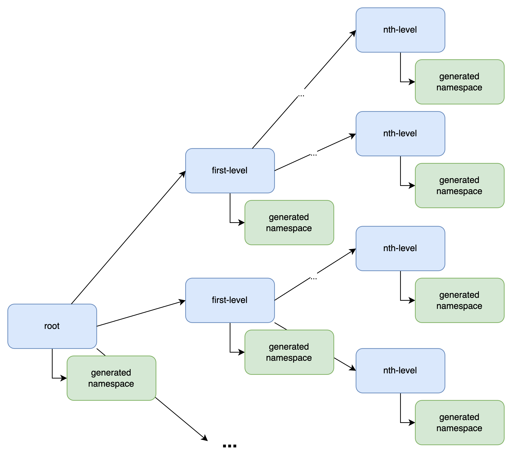

# RFC for openMFP Account Hierarchy

## Context and Problem Statement

This document provides an outline of how and what should be achieved with an account hierarchy model within openMFP. An account will have the ability to benefit from other accounts that it is a child of, e.g., by inheriting extensions provided by its parents. This will allow for easier distribution of central extensions and give more structure to the entire account setup.

## Decision Drivers

- Accounts within the same hierarchy must be able to inherit extensions from their parents until the root is reached.
- There is (theoretically) no limit on the depth of the hierarchy.
- There will be a root account (root of the hierarchy tree) that provides the necessary foundation for all other accounts.
- "First-Level Accounts" have a special role and act as a top-level separator for configurations.

## Options Considered

- A tree-like structure without explicit linking of the accounts

### A tree-like structure without explicit linking of the accounts

In this scenario, accounts establish a parent-child relationship in a tree structure not via explicitly referencing their parent or their children but rather by being placed in a particular **namespace** owned by an account.

The above diagram visualizes how such a tree could look. Every account currently generates a namespace. When another account resource is being placed within that namespace, the new account will be considered a child of the account that generated the namespace.

An nth-level child of the account will inherit the following properties from its parents (until the root is reached):

1. It will recursively look up the extensions specified in all accounts up the chain and apply them to the new account as well.

There is also a special role that the first-level children of the root account have. These first-level accounts can be seen as a tenant-like concept that allows top-level separation for parts of the tree that might need a different set of extensions applied to them.

## Benefits and Drawbacks

- **Pros:**
  - Easy way of central distribution of extensions to all accounts in the system.
- **Cons:**
  - It might be intransparent and a bit of effort to figure out the hierarchy chain up to the root account and therefore get a list of all the extensions.