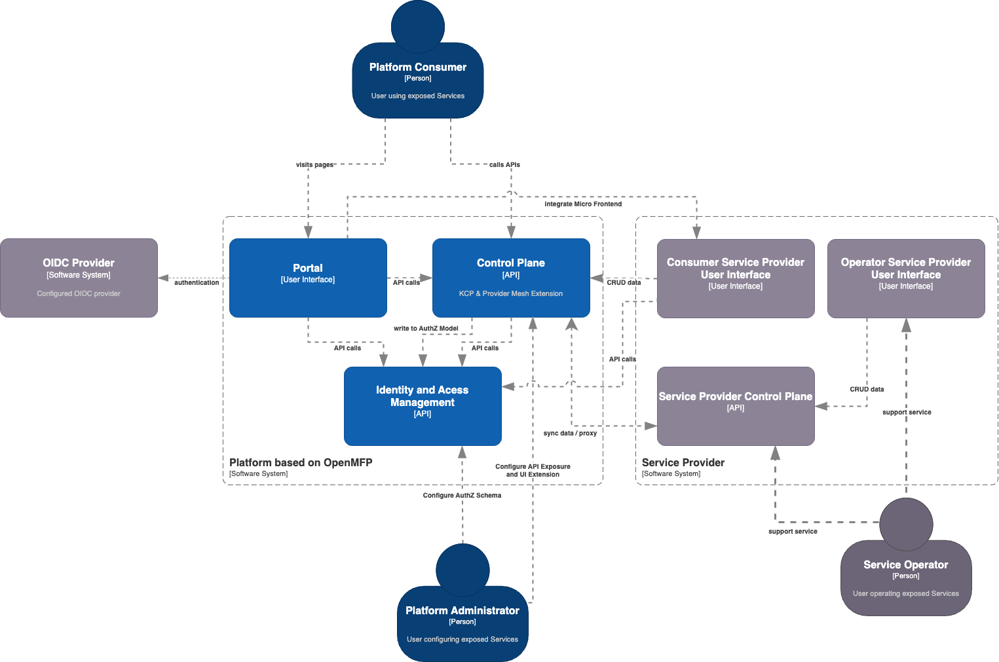

# RFC for openMFP Account Management and Service Integration using a Central Control Plane

## Overview

The goal of the Open Micro Frontend Platform is to be an extensible foundation to build a micro frontend based platform that enables service providers to expose a variety of services to its users. Here we strive to achieve a seamless user experience for all primary interfaces including User Interface (UI), Application Programming Interfaces (API) and Command Line Interfaces (CLI).

In Order to achieve this goal the overall architecture needs to include extensibility approaches for these interface layers. The Kubernetes Resource Model (KRM) is a powerful approach that offers out of the box extensibility functionalities for the API and CLI layers. Utilizing the Kubernetes Resource Model as central extensibility approach for API's streamlines the end user experience on how to interact with the platform:
* Single Authentication and Authorization Layer
* Shared API paradigms using declarative API's
* API definition using open api specification
* Common API approaches using yaml/json data structures 
* Common API Extensibility approaches with Custom Resource Definitions (CRD's)
* Common CLI tooling with the well known kubectl
* Common CLI extensibility approaches with kubectl plugins

A connected service provider will be able to expose its service specific API definitions, configure its end user micro frontend and also configure how the identity and access service should secure access to its entities for end users. Typically service providers will want to expose their end user facing APIs while also maintaining an internal facing version of given API's internally to avoid exposing unrelevant information to the API consumer. The OpenMFP Control Plane supports this setup by only syncing the end user facing api's between the central control plane and the service provider API.

## Control Plane and Account Management

The OpenMFP Control Plane will be KRM based. Using a Kubernetes Cluster directly as central control plane has various disadvantages:
* Kubernetes by default, as it was build for running workloads, exposes a number of resources that are not relevant for the way OpenMFP intends to use the Central Control Plane, eg. Pods, Deployments and more.
* API extensions using Custom Resource Definitions are visible across all Namespaces of a Kubernetes cluster. Limiting visibility of available API is a desirable feature.
* Namespaces are by default non hierachical. To be used as accounting structure namespaces can only be used as a pseudo hierachical structure by implementing a parent relationship between namespaces.
* One OIDC configuration per kubernetes cluster. It is not possible to use a different OIDC configuration on an account/namespace level.
* Its rather heavy weight. There are several control plane components that won't be used if a Kubernetes Cluster is only used as declarative control plane.

Due to above disadvantages OpenMFP is looking to integrate into [KCP](https://kcp.io)(https://kcp.io) and use it as a technology to provide central control plane features.

KCP out of the box brings features that address above disadvantages of a standard Kubernetes Cluster:
* Workspaces concept creates additional isolations for resources and API's
* Workspaces can be hierachically structured
* No additional unused control plane components 

Some features are missing in KCP, but it is planned to address them with the KCP team:
* OIDC configuration on the workspace level
* Ability to configure authorization webhooks

The OpenMFP Control Plane based on KCP will then be able to utilize the Workspace Concept as a basis for a technical account model:

## Control Plane and Authorization

A service provider will be able to provide configuration on how the resources in the central control plane should be secured using fine-grained authorization. This authorization configuration will be limited to the central OpenMFP Control Plane and should not reach the service provider domain directly.
By having all end user relevant resources in the central control plane it will be possible to automatically update the openFGA service in case of changes without the need to have the service provider keep this state up to date.

It is planned that the control plane is configured to use authorization webhooks to integrate into openFGA in case an API client requests a certain resource. Given that all resources in the Central Control Plane are customer facing resources, all resources of the central control plane will also be registered into openFGA automatically. When binding to a new API in a workspace on the control plane, the openFGA authorization model of that workspace will automatically be adapted.

## Best Practices for Service Provider Micro Frontends

It is desirable that the End User Interface displays and modifies the data that is available in the user facing API of a respective service. As a result a consumer user interface should directly leverage and modify the data available in the central control plane. To properly reflect the available authorizations of the consumer UI, the UI may need to directly integrate to the IAM for permission checks.

Operators of respective services will likely need access to additional information that is typically hidden from end users of a service. Therefore, it is likely that the Service Operators will need to use an Operation focussed interface that is directly interacting with the service specific API. Also, Service Operators may be external users not known by the openMFP platform and a different authorization concept may be needed.